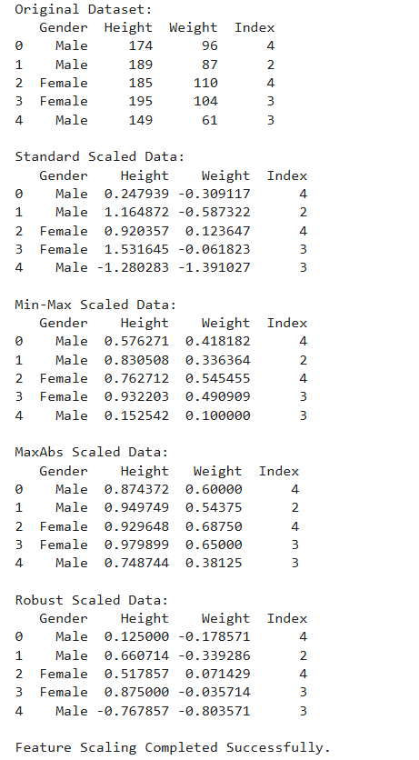

# EXNO:4-DS
# AIM:
To read the given data and perform Feature Scaling and Feature Selection process and save the
data to a file.

# ALGORITHM:
STEP 1:Read the given Data.
STEP 2:Clean the Data Set using Data Cleaning Process.
STEP 3:Apply Feature Scaling for the feature in the data set.
STEP 4:Apply Feature Selection for the feature in the data set.
STEP 5:Save the data to the file.

# FEATURE SCALING:
1. Standard Scaler: It is also called Z-score normalization. It calculates the z-score of each value and replaces the value with the calculated Z-score. The features are then rescaled with x̄ =0 and σ=1
2. MinMaxScaler: It is also referred to as Normalization. The features are scaled between 0 and 1. Here, the mean value remains same as in Standardization, that is,0.
3. Maximum absolute scaling: Maximum absolute scaling scales the data to its maximum value; that is,it divides every observation by the maximum value of the variable.The result of the preceding transformation is a distribution in which the values vary approximately within the range of -1 to 1.
4. RobustScaler: RobustScaler transforms the feature vector by subtracting the median and then dividing by the interquartile range (75% value — 25% value).

# FEATURE SELECTION:
Feature selection is to find the best set of features that allows one to build useful models. Selecting the best features helps the model to perform well.
The feature selection techniques used are:
1.Filter Method
2.Wrapper Method
3.Embedded Method

# CODING AND OUTPUT:

```
import numpy as np
import pandas as pd
from sklearn.preprocessing import StandardScaler, MinMaxScaler, MaxAbsScaler, RobustScaler

df = pd.read_csv('bmi.csv')   # Make sure bmi.csv is in the same directory

print("Original Dataset:")
print(df.head())

df = df.dropna()

df_std = df.copy()
scaler_std = StandardScaler()
df_std[['Height', 'Weight']] = scaler_std.fit_transform(df_std[['Height', 'Weight']])

print("\nStandard Scaled Data:")
print(df_std.head())

df_minmax = df.copy()
scaler_minmax = MinMaxScaler()
df_minmax[['Height', 'Weight']] = scaler_minmax.fit_transform(df_minmax[['Height', 'Weight']])

print("\nMin-Max Scaled Data:")
print(df_minmax.head())

df_maxabs = df.copy()
scaler_maxabs = MaxAbsScaler()
df_maxabs[['Height', 'Weight']] = scaler_maxabs.fit_transform(df_maxabs[['Height', 'Weight']])

print("\nMaxAbs Scaled Data:")
print(df_maxabs.head())

df_robust = df.copy()
scaler_robust = RobustScaler()
df_robust[['Height', 'Weight']] = scaler_robust.fit_transform(df_robust[['Height', 'Weight']])

print("\nRobust Scaled Data:")
print(df_robust.head())

print("\nFeature Scaling Completed Successfully.")
```



# RESULT:

Successfully read the given data and performed Feature Scaling and Feature Selection process and saved`` the
data to a file.
